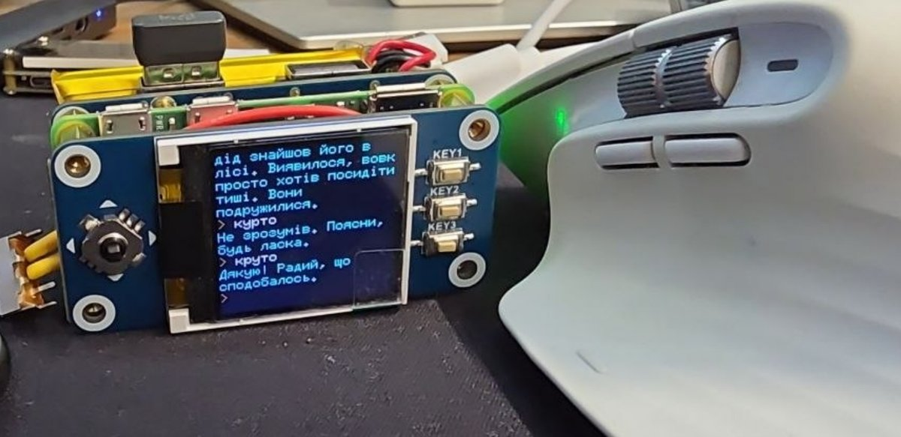
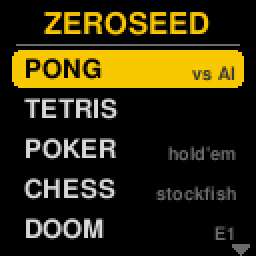
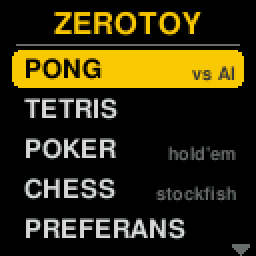
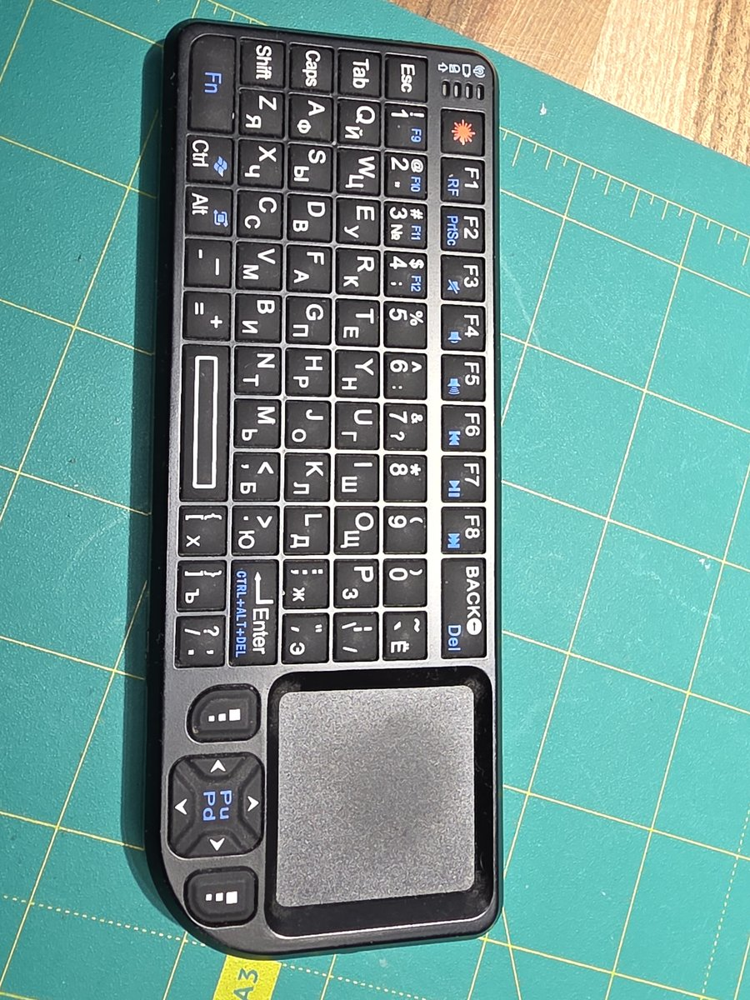
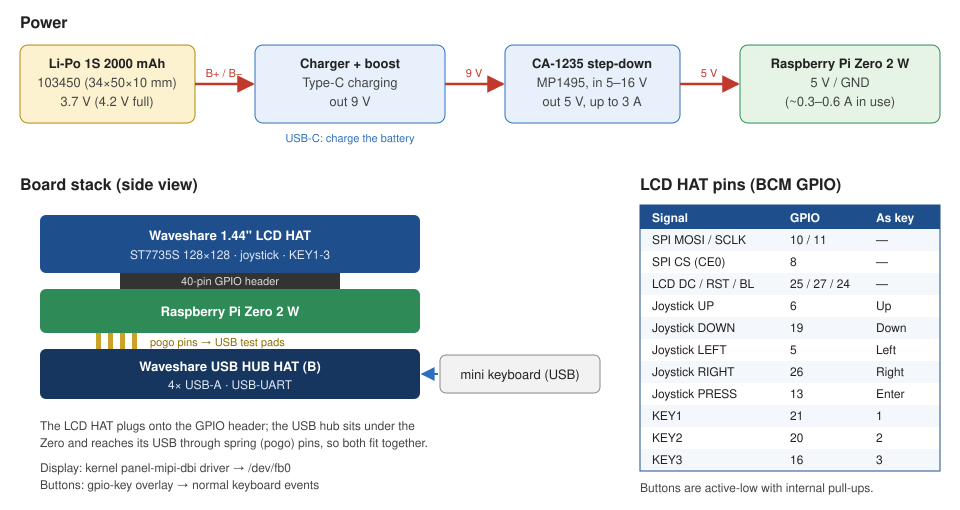
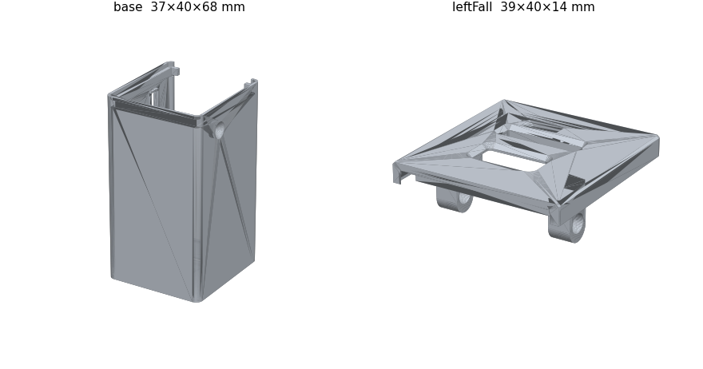

*[Українська версія](README.md)*

# pico2w-toy

A pocket game console / AI terminal built from a **Raspberry Pi Zero 2 W** and a **Waveshare 1.44" LCD HAT**
(128×128, joystick + 3 buttons), running stock Raspberry Pi OS Bookworm.

A launcher menu starts at boot and offers Pong, Tetris, Texas Hold'em poker, chess against Stockfish,
Doom, a chat with a local LLM, a text console and power-off. Everything is controlled with the HAT's
joystick and buttons or with a small USB keyboard.



| Menu | Pong | Tetris | Poker |
|:---:|:---:|:---:|:---:|
|  |  |  |  |
| **Chess** | **Preferans** | **Doom** | **AI chat** |
|  |  |  |  |

*(GIFs are recorded straight from the display's framebuffer with `tools/record_gif.py`, 2× scaled.)*

## 1. Description

| Menu item | What it is |
|---|---|
| **PONG** | Pong against the computer, 3 difficulty levels, first to 7 |
| **TETRIS** | 10×20 Tetris: ghost piece, wall kicks, 7-bag, levels, saved high score |
| **POKER** | Heads-up Texas Hold'em vs. a Monte-Carlo AI, rising blinds |
| **CHESS** | Chess vs. Stockfish 15 (8 levels), undo, promotion choice, auto-saved game |
| **PREFERANS** | Preferans (Russian whist) against two computer players: Sochi (default) or Leningrad rules, chosen when a new pulka starts, pulka to 20, auto-saved. Engine and AI: [Python Pref](https://python-pref.sourceforge.io/index_ru.html) (the same one that ran on Nokia/Symbian), ported to Python 3 |
| **DOOM** | Doom (shareware episode 1) via [doomgeneric](https://github.com/ozkl/doomgeneric), downscaled to 128×80 |
| **AI CHAT** | Chat with a local LLM (llama.cpp / any OpenAI-compatible server) on the text console, US/UA keyboard |
| **CONSOLE** | Leaves the menu and opens a text console with login on the LCD (tty7); `lcdmenu` brings the menu back |
| **HDMI** | Lends the USB keyboard to the console on the monitor (tty1); the HAT buttons stay with the menu, KEY3 takes the keyboard back |
| **POWER OFF** | Clean shutdown, with confirmation |

How the pieces fit together:

- **Display** - the kernel's [panel-mipi-dbi](https://github.com/notro/panel-mipi-dbi/wiki) DRM driver
  drives the ST7735S over SPI and exposes it as `/dev/fb0` (no `fbcp`, which doesn't work under KMS on
  Bookworm). Its init sequence is `/lib/firmware/waveshare144.bin`, generated by `firmware/mkpanel.py`.
- **Buttons** - the `gpio-key` overlay turns the joystick and KEY1-3 into ordinary keyboard keys
  (arrows, Enter, 1/2/3), so they work everywhere, including the text console.
- **Apps** - pygame draws into an off-screen 128×128 surface, `app/lcd.py` converts it to RGB565 and
  writes it to the framebuffer, and turns HAT buttons and any USB keyboard (hot-plugged too) into
  pygame key events.
- **HDMI** - a normal Linux console (tty1 with login). The LCD has its own console, tty7 (`fbcon=map`),
  so a monitor and the LCD work at the same time. While the menu or a game runs it grabs the buttons and
  keyboards (`EVIOCGRAB`) so key presses don't also land in the HDMI console. To type on the monitor, use the
  **HDMI** menu item.
- **Menu** - `lcd-menu.service` starts at boot; games run as its child processes and return to it.
  The AI chat runs on tty7 (the LCD console) through its own service so it gets a real terminal (line editing, Cyrillic).

### Project files

| File / folder | Purpose |
|---|---|
| `install.sh` | One-shot installer for a fresh Raspberry Pi OS Bookworm (packages, driver, fonts, services) |
| `app/lcd.py` | Shared display + input layer for all pygame apps |
| `app/menu.py` | Launcher menu (scrolling list) |
| `app/pong.py`, `app/tetris.py`, `app/poker.py`, `app/chessgame.py` | The games |
| `app/preferans.py` | 128×128 Preferans front-end for the PyPref engine |
| `app/prefgame/` | [Python Pref](https://sourceforge.net/projects/python-pref/) 2.34 engine and AI, ported to Python 3 (GPL-3.0) |
| `app/ai_chat.py` | Streaming chat client for a llama.cpp / OpenAI-compatible server |
| `app/demo.py` | Minimal pygame example: draw something, read the buttons |
| `doom/doomgeneric_lcd.c` | doomgeneric backend: 320×200 → 128×80 box-filtered RGB565, HAT buttons + keyboard |
| `doom/Makefile.lcd`, `doom/build.sh` | Builds `app/doom/doomlcd` from a pinned doomgeneric revision |
| `firmware/mkpanel.py` | Generates the panel init file (`waveshare144.bin`, prebuilt copy included) |
| `fonts/` | Console fonts 5×7 (console, 25×18 chars) and 6×10 (AI chat, 21×12) + `build-fonts.sh` |
| `config/` | Everything that goes into the system - see [Configuration](#6-configuration) |
| `tools/` | `vkeys.py` virtual keyboard, `snap.py` screenshot, `record_gif.py` GIF recorder |
| `case/` | Case: FreeCAD model (`pico-toy.FCStd`) and STL files for printing |
| `docs/` | GIFs, photos, wiring diagram, case preview |

## 2. Controls

| Action | HAT | USB keyboard |
|---|---|---|
| Move / select | joystick | arrows |
| Confirm / start | joystick press or KEY1 | Enter / Space |
| Secondary action (pause, difficulty, all-in, game menu) | KEY2 | 2 |
| Back to the menu | KEY3 | Esc |

Per game:

| App | Controls |
|---|---|
| Pong | up/down - paddle, Enter - start/pause, 2 - difficulty |
| Tetris | ←/→ move, ↓ soft drop, ↑ or Enter rotate, KEY1/Space hard drop, 2 pause |
| Poker | ←/→ choose FOLD / CHECK-CALL / BET-RAISE, ↑/↓ bet size, 2 - all-in amount |
| Chess | joystick moves the cursor, Enter picks up / drops a piece, 2 - menu (undo, new game) |
| Preferans | ←/→ card or bid, ↑/↓ bid one level up / down, Enter confirms; when discarding Enter puts a card aside, ↓ takes it back, Enter again discards; 2 - score sheet |
| Doom | HAT: joystick move, press fire (+Enter), KEY1 use (+"y"), KEY2 next weapon, KEY3 menu. Keyboard: arrows, Ctrl fire, Space use, Alt strafe, Shift run, 1-7 weapons, Tab map, Esc menu |
| AI chat | type and Enter; `/new`, `/think` (toggle model reasoning), `/quit` or Ctrl+D; Ctrl+C stops an answer; Alt+Shift switches US/UA |

## 3. Component list

| Component | Photo | Description | Docs / shop |
|---|---|---|---|
| **Raspberry Pi Zero 2 W** |  | Quad-core Cortex-A53, 512 MB RAM, Wi-Fi/BT | [arduino.ua](https://arduino.ua/prod6668-raspberry-pi-zero-2-w), [raspberrypi.com](https://www.raspberrypi.com/products/raspberry-pi-zero-2-w/) |
| **Waveshare 1.44" LCD HAT** |  | ST7735S 128×128 SPI display, 5-way joystick, 3 buttons | [Waveshare Wiki](https://www.waveshare.com/wiki/1.44inch_LCD_HAT), [shop](https://www.waveshare.com/1.44inch-lcd-hat.htm) |
| **Waveshare USB HUB HAT (B)** |  | 4× USB-A hub for the Zero, connects through pogo pins under the board, onboard USB-UART | [Waveshare Wiki](https://www.waveshare.com/wiki/USB_HUB_HAT_(B)), [shop](https://www.waveshare.com/usb-hub-hat-b.htm) |
| **Li-Po 2000 mAh 103450** |  | 1S 3.7 V flat cell, 34×50×10 mm, with protection board | [arduino.ua](https://arduino.ua/prod3075-akkymylyator-li-po-2000mach-3-7v-formata-103450) |
| **Type-C charger + 9 V boost** |  | Mini power module (made for multimeters): charges the cell over USB-C, outputs 9 V | [Rozetka](https://rozetka.com.ua/ua/573636100/p573636100/) |
| **CA-1235 step-down** |  | MP1495 buck converter, 5-16 V in, selectable 1.25-5 V out, 3 A - set to 5 V | [example listing](https://www.aliexpress.us/item/3256802445813752.html) |
| **Mini keyboard** |  | Wireless mini keyboard with touchpad (Rii i8 type), 2.4 GHz USB dongle in the hub; any USB keyboard works | — |

## 4. Wiring



The LCD HAT uses SPI0 (CE0) plus GPIO 25/27/24 for DC/reset/backlight; the joystick and keys are on
GPIO 6, 19, 5, 26, 13, 21, 20, 16 (active-low, internal pull-ups). Nothing else needs to be wired by hand
except the power chain.

### Case



The printable case is in [`case/`](case):

| File | What it is |
|---|---|
| `pico-toy.FCStd` | FreeCAD model (V2, without the scan mesh of the device it was modelled around) |
| `pico-toy-base.stl` | Base: a 37×40×68 mm box that holds the board stack |
| `pico-toy-leftFall.stl` | Side frame, 39×40×14 mm - **draft, not designed yet** |

The STL files are exported from the FreeCAD model (0.02 mm deflection). The first version without a
case: [`docs/prototype-v1.jpg`](docs/prototype-v1.jpg).

## 5. Installation

Tested on Raspbian 12 (Bookworm) armhf, kernel 6.12, on a Pi Zero 2 W.

```bash
git clone https://github.com/iyalosovetsky/pico2w-toy.git
cd pico2w-toy
./install.sh          # --no-doom: skip Doom, --keep-desktop: leave the desktop on,
                      # --hdmi-mode=1280x720@60: another HDMI mode
sudo reboot           # first install only: loads the display driver
```

`install.sh` is meant to be run by the normal user (with sudo) the menu should run as. It:

1. installs `python3-pygame python3-numpy python3-pil stockfish doom-wad-shareware git build-essential`;
2. puts [python-chess](https://github.com/niklasf/python-chess) into `app/vendor` (it is not in the Raspbian repo);
3. writes `/lib/firmware/waveshare144.bin` and appends `config/boot-config.txt` to `/boot/firmware/config.txt`;
4. adds `video=HDMI-A-1:1920x1080@60D` to `/boot/firmware/cmdline.txt` (forces HDMI on - the Zero's kernel
   often misses the monitor even though the boot screen shows) and `fbcon=map:0000001` (tty1-6 on HDMI,
   tty7 on the LCD); installs the console fonts, sets the US+UA keyboard layout, creates `/etc/default/lcd-ai-chat`;
5. builds Doom (`doom/build.sh`);
6. installs and enables the systemd services (paths and user are filled in);
7. on a desktop image, switches boot to the console (`multi-user.target`) - the desktop would
   otherwise take over the LCD as a display.

Every system file it changes is backed up once as `<file>.bak-lcd`; it is safe to re-run.
Updating later is `git pull && ./install.sh`.

## 6. Configuration

All system configuration lives in [`config/`](config):

| File | Installed as | What it does |
|---|---|---|
| `boot-config.txt` | appended to `/boot/firmware/config.txt` | SPI, `mipi-dbi-spi` display overlay (size, offsets, DC/RST/BL pins), `gpio-key` overlays for the 8 buttons |
| `systemd/lcd-menu.service` | `/etc/systemd/system/` | Menu at boot; closes the LCD console (tty7) and brings HDMI (tty1) to the front |
| `systemd/lcd-console.service` | `/etc/systemd/system/` | Opens the LCD console (tty7, 5×7 font) when the menu exits |
| `systemd/ai-chat.service` | `/etc/systemd/system/` | AI chat on tty7 (LCD) with the 6×10 font, returns to the menu |
| `lcdmenu` | `/usr/local/bin/` | Command to get back to the menu from the LCD console (or over SSH) |
| `keyboard` | `/etc/default/keyboard` | US + Ukrainian layouts, Alt+Shift toggles, Scroll Lock LED = UA |
| `ai-chat.env` | `/etc/default/lcd-ai-chat` | `AI_URL` of the LLM server (default here: a llama.cpp server on the LAN) |

The HDMI consoles keep the normal font; the 5×7 font is set only on tty7 (LCD) by `lcd-console.service`.
`/boot/firmware/cmdline.txt` gets `video=HDMI-A-1:<mode>D` and `fbcon=map:0000001`.

**Display rotation.** Orientation comes from MADCTL in `firmware/mkpanel.py` (`0x68` = rotated 90°,
`0x08` = native). Rotating swaps the x/y offsets in `boot-config.txt` (`x-offset=1,y-offset=2` for 0x68,
`2,1` for 0x08).

**AI server.** Any server with an OpenAI-compatible `/v1/chat/completions` endpoint works, e.g.
[llama.cpp](https://github.com/ggml-org/llama.cpp) `llama-server`. Reasoning models are supported:
their thinking is shown as a single "(думаю...)" ("thinking...") line and is off by default (`/think` turns it on).

## 7. Notes and gotchas

- **`fbcp` does not work on Bookworm** (KMS removed dispmanx). The display is a real DRM/fbdev device here,
  so the text console, pygame and Doom all draw to the LCD framebuffer directly. Apps find it by driver
  name (`panel-mipi-dbi`): it is `fb1` with HDMI and `fb0` without.
- **HDMI on the Zero.** The firmware shows the boot screen, but the kernel may miss the monitor (hotplug)
  and create no console for it - then the whole console ends up on the LCD. `video=HDMI-A-1:...D` forces
  HDMI on.
- **`KEY_ENTER` clash in Doom.** `linux/input.h` defines `KEY_ENTER`, `KEY_TAB`, `KEY_F1`... with Linux
  key codes, overriding doomgeneric's `doomkeys.h` values of the same names - Doom then gets 28 instead
  of 13 for Enter and its menus stop working. `doomgeneric_lcd.c` uses explicit Doom codes for those.
- **readline prompt colours** must be wrapped in `\001...\002`, otherwise long input lines don't wrap.
- **SDL and SIGTERM.** SDL turns SIGTERM into a `QUIT` event; every app handles it, so `systemctl stop`
  is instant.
- **Testing without touching the device.** `tools/vkeys.py` creates a virtual keyboard
  (`sudo python3 tools/vkeys.py "down down enter"`), `tools/snap.py` saves a screenshot,
  `tools/record_gif.py` records the GIFs above.

## 8. Software used

| Component | Used for | License |
|---|---|---|
| [pygame](https://www.pygame.org/) | Drawing and input in all apps | LGPL |
| [panel-mipi-dbi](https://github.com/notro/panel-mipi-dbi/wiki) | Kernel display driver + init file format | GPL (kernel) |
| [doomgeneric](https://github.com/ozkl/doomgeneric) | Portable Doom; `doom/doomgeneric_lcd.c` is its backend | GPL-2.0 |
| Doom shareware WAD ([doom-wad-shareware](https://packages.debian.org/bookworm/doom-wad-shareware)) | Episode 1 game data | id Software shareware licence |
| [Stockfish](https://stockfishchess.org/) | Chess engine | GPL-3.0 |
| [python-chess](https://github.com/niklasf/python-chess) | Chess rules, UCI engine control | GPL-3.0 |
| [Python Pref](https://python-pref.sourceforge.io/index_ru.html) 2.34 (amigo, Vadim Zapletin; based on kpref and OpenPref) | Preferans engine and AI in `app/prefgame/` | GPL-3.0 |
| X11 misc-fixed fonts ([xfonts-base](https://packages.debian.org/bookworm/xfonts-base)) | Source of the 5×7 and 6×10 console fonts | Public domain |
| [llama.cpp](https://github.com/ggml-org/llama.cpp) | LLM server for the AI chat (runs on another machine) | MIT |

## 9. License

[GPL-3.0-or-later](LICENSE). The Doom backend is derived from doomgeneric / Chocolate Doom
(GPL-2.0-or-later) the chess app uses python-chess (GPL-3.0) and Preferans uses the Python Pref engine (GPL-3.0), so the
project as a whole is GPL-3.0.
The Doom shareware WAD is not part of this repository; it is installed from the
`doom-wad-shareware` package under id Software's shareware licence.
