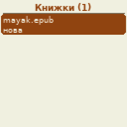
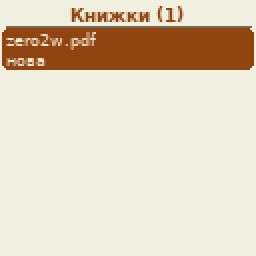
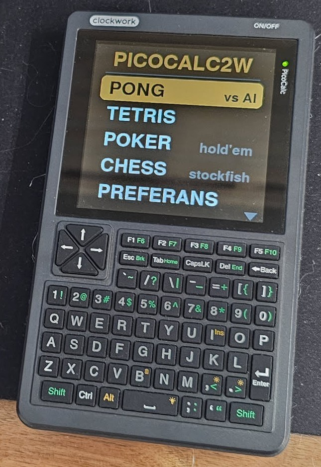
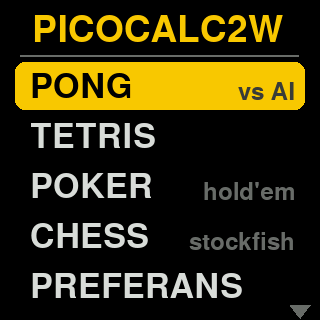
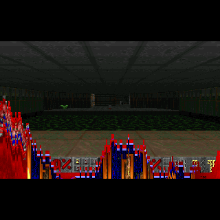
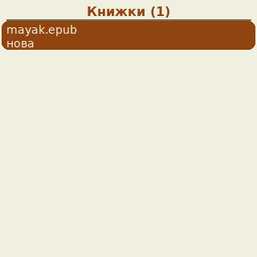
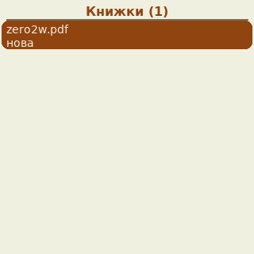
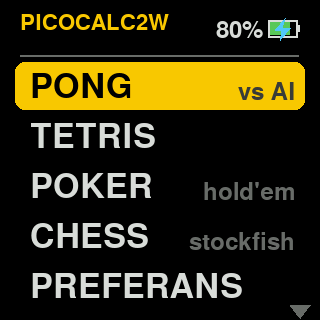
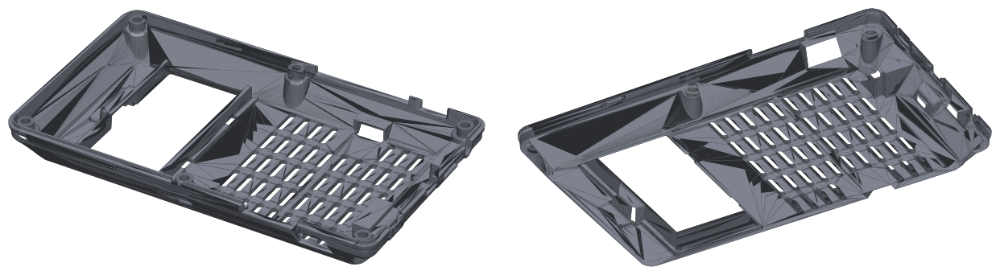

*[English version](README.en.md)*

# pico2w-toy

Кишенькова ігрова консоль / AI-термінал на **Raspberry Pi Zero 2 W** для двох пристроїв:

- **Waveshare 1.44" LCD HAT** - 128×128, джойстик + 3 кнопки, Raspberry Pi OS Bookworm (основний опис нижче);
- **[ClockworkPi PicoCalc](https://www.clockworkpi.com/picocalc)** із Zero 2 W замість Pico (zero mod) -
  320×320, клавіатура, PWM-звук, Raspberry Pi OS Trixie (розділ [PicoCalc](#picocalc)).

Код програм спільний: `app/lcd.py` сам визначає дисплей. `install.sh` визначає пристрій або бере
його з `--device=hat|picocalc`; конфігурація для кожного - у `config/hat/` і `config/picocalc/`.

Після ввімкнення запускається меню: Pong, тетріс, покер (техаський холдем), шахи проти Stockfish,
Doom, чат з локальною LLM, текстова консоль і вимкнення. Керування - джойстиком і кнопками HAT або
маленькою USB-клавіатурою.


| Меню | Pong | Тетріс | Покер |
|:---:|:---:|:---:|:---:|
|  |  |  |  |
| **Шахи** | **Преферанс** | **Doom** | **AI-чат** |
|  |  |  |  |
| **Книжки** | **PDF** | | |
|  |  | | |

*(GIF записані прямо з фреймбуфера дисплея скриптом `tools/record_gif.py`, збільшені вдвічі.)*

## PicoCalc



| Меню | Pong | Тетріс | Покер |
|:---:|:---:|:---:|:---:|
|  |  |  |  |
| **Шахи** | **Преферанс** | **Doom** | **AI-чат** |
|  |  |  |  |
| **Книжки** | **PDF** | **GENERATOR** (ESP32-C6) | |
|  |  |  | |

*(GIF записані з фреймбуфера PicoCalc 1:1, 320×320, скриптом `tools/record_gif.py`.)*

Ті самі програми на PicoCalc із Zero 2 W під Raspberry Pi OS **Trixie** Lite (32-bit):

- **Дисплей 320×320** (ST7365P, той самий драйвер `panel-mipi-dbi`). Ігри далі рахують у
  координатах 128×128, а `app/lcd.py` малює все в рідній роздільності: прямокутники, лінії, кола
  й шрифти множаться на `lcd.S` = 2.5, тож текст і графіка чіткі, а не розтягнуті. На HAT
  (S = 1) нічого не змінюється.
- **Клавіатура** PicoCalc (драйвер `picocalc_kbd`) працює як звичайна: стрілки, Enter, Esc,
  цифри. Підказки на екрані пишуть «Enter / 2 / Esc» замість «PRESS / KEY2 / KEY3».
  **CapsLock перемикає розкладку US ↔ UA** у консолі та AI-чаті (світлодіод Caps = UA,
  Shift+CapsLock - звичайний Caps Lock).
  **Права Shift** у драйвері PicoCalc вмикає/вимикає режим миші: стрілки тоді рухають курсор і не
  доходять до ігор (ігри й Doom відпускають затиснуті стрілки, щоб нічого не «залипало»). Якщо
  стрілки перестали працювати - натисніть праву Shift ще раз. Бігти в Doom - лівою Shift.
- **Звук** - PWM на GPIO 12/13 (`dtoverlay=audremap,pins_12_13`) у динаміки PicoCalc: ефекти в
  Pong, тетрісі, покері, шахах, преферансі й меню; пункт меню **SOUND** вмикає/вимикає їх, гучність -
  `LCD_VOLUME` у `/etc/default/lcd-toy`. Doom збирається зі звуком через SDL2_mixer.
- **Doom** показує кадр 320×200 один до одного (без зменшення), по центру екрана.
- **AI-чат** - на tty7 шрифтом Terminus 8×16 (40×20 символів).
- **PYTHON / BASIC / EDIT** - консольні інструменти на tty7 шрифтом Terminus 12×6 (53×26 символів),
  після виходу - назад у меню:
  - **PYTHON** - [bpython](https://bpython-interpreter.org/): REPL з підсвіткою, підказками й автодоповненням,
    робоча тека `~/code`; вихід - Ctrl+D;
  - **BASIC** - [MMBasic для Linux](https://github.com/thwill1000/mmb4l) - BASIC рідної прошивки PicoCalc
    (PicoMite), тека `~/basic`; `EDIT` відкриває nano з підсвіткою MMBasic; вихід - `QUIT`;
  - **EDIT** - редактор [micro](https://micro-editor.github.io/) (Ctrl+S, Ctrl+Q, Ctrl+O - відкрити файл),
    за замовчуванням `~/code/scratch.py`.
- **Консолі:** меню працює на tty8 у графічному режимі (щоб ядро нічого не малювало поверх),
  **CONSOLE** відкриває звичайну tty1 з автологіном, `lcdmenu` повертає меню. Пункту HDMI
  немає - він з'являється лише там, де є HDMI-фреймбуфер.

### Встановлення на PicoCalc

1. Raspberry Pi OS Trixie Lite 32-bit, дисплей і клавіатура - за кроками 4-5
   [picocalc_trixie](https://github.com/ironat/picocalc_trixie) (`picomipi.bin`, `picocalc_kbd`).
2. Далі:

```bash
git clone https://github.com/iyalosovetsky/pico2w-toy.git
cd pico2w-toy
./install.sh --device=picocalc   # --no-doom - не збирати Doom
```

`install.sh` перевіряє дисплей і клавіатуру, ставить пакети (разом із SDL2 для звуку Doom),
додає звук у `config.txt`, кладе `/etc/asound.conf` (вихід PWM), `/etc/default/lcd-toy`, збирає
Doom і вмикає сервіси. Що має бути в `config.txt` - див. [`config/picocalc/boot-config.txt`](config/picocalc/boot-config.txt).

### Підводні камені звуку на PicoCalc

- **`dmix` не годиться:** на картці bcm2835 він зависає при закритті пристрою. Тому
  `/etc/asound.conf` дає прямий доступ (`plug` → `hw:Headphones`), а меню звільняє звук на час гри.
- **Не вбивати процес зі звуком:** якщо процес убито, поки звук відкритий, драйвер
  `bcm2835-audio` хвилинами закриває пристрій («failed to close VCHI service connection»).
  Усі програми виходять штатно по SIGTERM, Doom теж (власний обробник → `I_Quit()`).
- **Буфер 2048 семплів на 44100 Гц:** з меншим буфером Python не встигає і сиплються underrun.

### Задня кришка для Zero 2 W



Задня кришка PicoCalc 172×103×20 мм під zero mod (Zero 2 W замість Pico):

| Файл | Що це |
|---|---|
| [`case/myPicoCalcZero2wV2.FCStd`](case/myPicoCalcZero2wV2.FCStd) | Модель FreeCAD (тіло `backCase`) |
| [`case/picocalc-zero2w-back.stl`](case/picocalc-zero2w-back.stl) | STL для друку (вивантажено з моделі, точність 0.02 мм) |

## 1. Опис

| Пункт меню | Що це |
|---|---|
| **PONG** | Pong проти комп'ютера, 3 рівні складності, гра до 7 |
| **TETRIS** | Тетріс 10×20: тінь фігури, поворот біля стіни, «мішок» із 7 фігур, рівні, рекорд зберігається |
| **POKER** | Техаський холдем один на один проти AI (Монте-Карло), блайнди ростуть |
| **CHESS** | Шахи проти Stockfish 15 (8 рівнів), відкат ходу, вибір фігури при перетворенні, автозбереження |
| **PREFERANS** | Преферанс проти двох AI: Сочинка (за замовчуванням) або Ленінградка - вибір на старті нової пульки, пулька до 20, автозбереження пульки. Рушій і AI - [Python Pref](https://python-pref.sourceforge.io/index_ru.html) (той самий, що був для Nokia/Symbian), портований на Python 3 |
| **BOOKS** | Читалка книжок EPUB / FB2 / TXT (і в ZIP) та PDF з теки `~/books`: картинки, зміст, розмір шрифту, світла/темна тема; PDF - збільшені фрагменти сторінки й плавна прокрутка; позиція в кожній книжці зберігається |
| **DOOM** | Doom (shareware, 1-й епізод) на [doomgeneric](https://github.com/ozkl/doomgeneric), зменшений до 128×80 |
| **GENERATOR** | Генератор меандру на ESP32-C6 (PicoCalc, через UART): частота, скважність, увімк/вимк; світлодіод ESP показує скважність і частоту - див. [ESP32-C6](#компоненти-picocalc) |
| **AI CHAT** | Чат з локальною LLM (llama.cpp або будь-який OpenAI-сумісний сервер) у текстовій консолі, розкладка US/UA |
| **CONSOLE** | Закриває меню і відкриває текстову консоль на LCD (tty7) з логіном; команда `lcdmenu` повертає меню |
| **HDMI** | Віддає USB-клавіатуру консолі на моніторі (tty1); кнопки HAT лишаються в меню, KEY3 повертає клавіатуру меню |
| **POWER OFF** | Коректне вимкнення з підтвердженням |

Як це влаштовано:

- **Дисплей** - DRM-драйвер ядра [panel-mipi-dbi](https://github.com/notro/panel-mipi-dbi/wiki)
  керує ST7735S по SPI і створює `/dev/fb0` (без `fbcp`, який на Bookworm під KMS не працює).
  Послідовність ініціалізації - `/lib/firmware/waveshare144.bin`, її генерує `firmware/mkpanel.py`.
- **Кнопки** - overlay `gpio-key` перетворює джойстик і KEY1-3 на звичайні клавіші (стрілки, Enter,
  1/2/3), тому вони працюють усюди, навіть у текстовій консолі.
- **Програми** - pygame малює у поверхню 128×128 в пам'яті, `app/lcd.py` перетворює її в RGB565,
  пише у фреймбуфер, а натискання кнопок HAT і будь-якої USB-клавіатури (і під'єднаної пізніше теж)
  перетворює на події клавіатури pygame.
- **HDMI** - звичайна консоль Linux (tty1 з логіном). LCD має власну консоль tty7 (`fbcon=map`), тож
  монітор і LCD працюють одночасно. Поки відкрите меню чи гра, вони перехоплюють кнопки й клавіатуру
  (`EVIOCGRAB`), щоб натискання не потрапляли в консоль на HDMI. Щоб друкувати на моніторі, є пункт
  меню **HDMI**.
- **Меню** - `lcd-menu.service` стартує при завантаженні; ігри запускаються як його дочірні процеси
  і повертаються в нього. AI-чат працює на tty7 (консоль LCD) через окремий сервіс, щоб мати справжній термінал
  (редагування рядка, кирилиця).

### Файли проєкту

| Файл / папка | Призначення |
|---|---|
| `install.sh` | Встановлення «в один крок» (пакети, драйвер, шрифти, сервіси) для HAT або PicoCalc |
| `app/lcd.py` | Спільний шар дисплея та вводу для всіх програм на pygame |
| `app/menu.py` | Меню запуску (список із прокручуванням) |
| `app/pong.py`, `app/tetris.py`, `app/poker.py`, `app/chessgame.py` | Ігри |
| `app/preferans.py` | Інтерфейс преферансу 128×128 для рушія PyPref |
| `app/reader.py`, `app/books.py`, `app/pdfdoc.py` | Читалка: інтерфейс, розбір EPUB / FB2 / TXT / ZIP (FB2 і TXT у будь-якому кодуванні), сторінки PDF через `pdftoppm` |
| `app/prefgame/` | Рушій і AI [Python Pref](https://sourceforge.net/projects/python-pref/) 2.34, портовані на Python 3 (GPL-3.0) |
| `app/ai_chat.py` | Клієнт чату з потоковою відповіддю для llama.cpp / OpenAI-сумісного сервера |
| `app/demo.py` | Мінімальний приклад на pygame: намалювати щось і прочитати кнопки |
| `app/term.sh` | Запуск консольних інструментів PicoCalc: PYTHON (bpython), BASIC (MMBasic), EDIT (micro) |
| `doom/doomgeneric_lcd.c` | Backend для doomgeneric: 320×200 → 128×80 зі згладжуванням, RGB565, кнопки HAT + клавіатура |
| `doom/Makefile.lcd`, `doom/build.sh` | Збирає `app/doom/doomlcd` із зафіксованої версії doomgeneric |
| `firmware/mkpanel.py` | Генерує файл ініціалізації дисплея (`waveshare144.bin`, готова копія теж є) |
| `fonts/` | Консольні шрифти 5×7 (консоль, 25×18 символів) і 6×10 (AI-чат, 21×12) + `build-fonts.sh` |
| `config/` | Усе, що встановлюється в систему: `hat/`, `picocalc/` і спільне - див. [Конфігурація](#6-конфігурація) |
| `tools/` | `vkeys.py` - віртуальна клавіатура, `snap.py` - скриншот, `record_gif.py` - запис GIF |
| `case/` | Корпус: модель FreeCAD (`pico-toy.FCStd`) і STL для друку |
| `docs/` | GIF, фото, схема підключення, перегляд корпусу |

## 2. Керування

| Дія | HAT | USB-клавіатура |
|---|---|---|
| Рух / вибір | джойстик | стрілки |
| Підтвердити / почати | натиск джойстика або KEY1 | Enter / Space |
| Додаткова дія (пауза, складність, ва-банк, меню гри) | KEY2 | 2 |
| Назад у меню | KEY3 | Esc |
| Довідка до пункту головного меню (керування, команди) | KEY1 | F1 |

По іграх:

| Програма | Керування |
|---|---|
| Pong | вгору/вниз - ракетка, Enter - старт/пауза, 2 - складність |
| Тетріс | ←/→ рух, ↓ прискорити, ↑ або Enter поворот, KEY1/Space скинути, 2 пауза |
| Покер | ←/→ вибір FOLD / CHECK-CALL / BET-RAISE, ↑/↓ розмір ставки, 2 - ва-банк |
| Шахи | джойстик рухає курсор, Enter бере / ставить фігуру, 2 - меню (відкат, нова гра) |
| Преферанс | ←/→ карта або заявка, ↑/↓ заявка на рівень вище / нижче, Enter - підтвердити; при зносі Enter відкладає карту, ↓ повертає, Enter ще раз - знести; 2 - запис пульки |
| Книжки | ←/→ (↑/↓, PgUp/PgDn, Space) - сторінки, KEY2 / 2 / Tab - меню (зміст, шрифт, тема), KEY3 / Esc - до бібліотеки; з клавіатури + / - шрифт, Home / End - початок / кінець розділу. PDF: ↑/↓ - сторінка, ←/→ - фрагменти, + / - (KEY1 / KEY2) - масштаб, Enter / натиск - плавна прокрутка стрілками, Esc / KEY3 - назад до фрагментів |
| Doom | HAT: джойстик рух, натиск - постріл (+Enter), KEY1 двері (+«y»), KEY2 наступна зброя, KEY3 меню. Клавіатура: стрілки, Enter або Ctrl постріл (Enter у меню - вибір), Space двері, Alt боком, ліва Shift біг, 1-7 зброя, Tab карта, Esc меню |
| AI-чат | пишете й Enter; `/new`, `/think` (міркування моделі), `/quit` або Ctrl+D; Ctrl+C зупиняє відповідь; Alt+Shift - US/UA |

## 3. Компоненти

| Компонент | Фото | Опис | Документація / магазин |
|---|---|---|---|
| **Raspberry Pi Zero 2 W** |  | 4 ядра Cortex-A53, 512 МБ RAM, Wi-Fi/BT | [arduino.ua](https://arduino.ua/prod6668-raspberry-pi-zero-2-w), [raspberrypi.com](https://www.raspberrypi.com/products/raspberry-pi-zero-2-w/) |
| **Waveshare 1.44" LCD HAT** |  | Дисплей ST7735S 128×128 SPI, 5-позиційний джойстик, 3 кнопки | [Waveshare Wiki](https://www.waveshare.com/wiki/1.44inch_LCD_HAT), [магазин](https://www.waveshare.com/1.44inch-lcd-hat.htm) |
| **Waveshare USB HUB HAT (B)** |  | Хаб 4× USB-A для Zero, кріпиться знизу на пружинних контактах (pogo pins), USB-UART на платі | [Waveshare Wiki](https://www.waveshare.com/wiki/USB_HUB_HAT_(B)), [магазин](https://www.waveshare.com/usb-hub-hat-b.htm) |
| **Li-Po 2000 мА·год 103450** |  | 1S 3.7 В, плаский, 34×50×10 мм, з платою захисту | [arduino.ua](https://arduino.ua/prod3075-akkymylyator-li-po-2000mach-3-7v-formata-103450) |
| **Модуль заряду Type-C + підвищення до 9 В** |  | Міні-модуль живлення (для мультиметрів): заряджає акумулятор від USB-C, видає 9 В | [Rozetka](https://rozetka.com.ua/ua/573636100/p573636100/) |
| **Понижувальний CA-1235** |  | Перетворювач на MP1495, вхід 5-16 В, вихід 1.25-5 В на вибір, 3 А - виставлений на 5 В | [приклад](https://www.aliexpress.us/item/3256802445813752.html) |
| **Міні-клавіатура** |  | Бездротова міні-клавіатура з тачпадом (типу Rii i8), USB-приймач 2.4 ГГц у хабі; підійде будь-яка USB-клавіатура | — |

### Компоненти PicoCalc

| Компонент | Фото | Опис | Документація / магазин |
|---|---|---|---|
| **ClockworkPi PicoCalc** |  | Кишеньковий комп’ютер: екран 320×320, клавіатура, динаміки, відсік для акумуляторів; Zero 2 W стоїть замість Pico (zero mod) | [clockworkpi.com](https://www.clockworkpi.com/picocalc) |
| **Raspberry Pi Zero 2 W** |  | Той самий Zero 2 W, що й у версії з HAT | [raspberrypi.com](https://www.raspberrypi.com/products/raspberry-pi-zero-2-w/) |
| **Pololu U3V40F5** |  | Підвищувальний DC-DC перетворювач на 5 В: вхід 1.3-5 В (старт від 2.7 В), до 4 А вхідного струму, 15×15 мм | [arduino.ua](https://arduino.ua/prod5037-povishaushhii-dc-dc-preobrazovatel-5v-u3v40f5-ot-pololu), [pololu.com](https://www.pololu.com/product/4012) |
| **Модуль USB 2.0 Hub FE1.1S** |  | USB-хаб 1→4 порти на FE1.1S | [ekran.in.ua](https://ekran.in.ua/ua/p3100872448-modul-usb-hub.html) |
| **Waveshare ESP32-C6-Zero** |  | ESP32-C6 (RISC-V 160 МГц), Wi-Fi 6, Bluetooth 5 LE, Zigbee/Thread, 8 МБ Flash, USB Type-C; підключена до UART Zero 2 W | [Waveshare Wiki](https://docs.waveshare.com/ESP32-C6-Zero), [магазин](https://www.waveshare.com/esp32-c6-zero.htm) |

**ESP32-C6 ↔ Zero 2 W (UART, 3.3 В на обох боках, рівні узгоджувати не треба).** TX/RX на ESP32-C6-Zero
підписані у верхньому правому куті (стороною з чипом до себе, Type-C угорі) - це її UART0:

| ESP32-C6-Zero | Zero 2 W |
|---|---|
| TX (GPIO16, UART0 TX) | RXD - GPIO 15, пін 10 |
| RX (GPIO17, UART0 RX) | TXD - GPIO 14, пін 8 |
| GND | GND, напр. пін 6 |

На Zero це стандартний UART `/dev/serial0` (mini UART `ttyS0`, Bluetooth лишається на PL011).
`install.sh --device=picocalc` вмикає його (`enable_uart=1` у `config.txt`) і прибирає з
`cmdline.txt` консоль `console=serial0,115200`, щоб порт був вільний для програм.

**Генератор меандру на ESP32-C6** ([`tools/esp32c6/`](tools/esp32c6)). На ESP32-C6 стоїть MicroPython;
програма [`main.py`](tools/esp32c6/main.py) видає меандр на **GPIO19** (2 Гц - 1 МГц) і слухає команди
з UART. Вбудований RGB-світлодіод світить тим яскравіше, чим більша скважність, а колір залежить від
частоти (логарифмічно: 2 Гц червоний … 1 МГц фіолетовий). Керування із Zero - команда `esp32c6`
(її ставить `install.sh`):

```bash
esp32c6 freq 2.5k duty 25    # частота (Гц, k, M) і скважність (%)
esp32c6 off                  # вимкнути вихід; on - увімкнути
esp32c6 get                  # ok freq=2500 duty=25 out=on
```

Залити програму на ESP32-C6, під'єднану Type-C до Zero (`/dev/ttyACM0`):
`python3 tools/esp32c6/mpy_put.py /dev/ttyACM0 tools/esp32c6/main.py`.

## 4. Схема


LCD HAT використовує SPI0 (CE0) і GPIO 25/27/24 для DC/reset/підсвітки; джойстик і кнопки - на
GPIO 6, 19, 5, 26, 13, 21, 20, 16 (активний низький рівень, внутрішня підтяжка). Вручну паяти треба
лише живлення.

### Корпус


Корпус для друку - у папці [`case/`](case):

| Файл | Що це |
|---|---|
| `pico-toy.FCStd` | Модель FreeCAD (V2, без сітки-скану пристрою, з якої робився корпус) |
| `pico-toy-base.stl` | Основа: коробка 37×40×68 мм, у яку ставиться стек плат |
| `pico-toy-leftFall.stl` | Бічна рамка 39×40×14 мм |

Кришки для дисплея ще немає - вона в розробці. STL вивантажені з моделі FreeCAD (точність 0.02 мм). Перша версія без корпусу:
[`docs/prototype-v1.jpg`](docs/prototype-v1.jpg).

## 5. Встановлення

Для HAT нижче; для PicoCalc - [Встановлення на PicoCalc](#встановлення-на-picocalc).
Перевірено на Raspbian 12 (Bookworm) armhf, ядро 6.12, Pi Zero 2 W.

```bash
git clone https://github.com/iyalosovetsky/pico2w-toy.git
cd pico2w-toy
./install.sh --device=hat   # без --device пристрій визначається сам (або спитає)
                            # --no-doom - не збирати Doom, --keep-desktop - не вимикати робочий стіл,
                            # --hdmi-mode=1280x720@60 - інший режим HDMI
sudo reboot           # лише при першому встановленні: завантажити драйвер дисплея
```

`install.sh` запускається від звичайного користувача (із sudo), від якого працюватиме меню. Він:

1. ставить `python3-pygame python3-numpy python3-pil stockfish doom-wad-shareware git build-essential`;
2. кладе [python-chess](https://github.com/niklasf/python-chess) в `app/vendor` (у репозиторії Raspbian її немає);
3. записує `/lib/firmware/waveshare144.bin` і дописує `config/hat/boot-config.txt` у `/boot/firmware/config.txt`;
4. дописує в `/boot/firmware/cmdline.txt` `video=HDMI-A-1:1920x1080@60D` (примусово вмикає HDMI - ядро на Zero
   часто не бачить монітор, хоча екран завантаження є) і `fbcon=map:0000001` (tty1-6 на HDMI, tty7 на LCD);
   встановлює консольні шрифти, розкладку US+UA, створює `/etc/default/lcd-ai-chat`;
5. збирає Doom (`doom/build.sh`);
6. встановлює й вмикає systemd-сервіси (шляхи й користувач підставляються автоматично);
7. на образі з робочим столом перемикає завантаження в консоль (`multi-user.target`), бо робочий стіл
   захопив би LCD як дисплей.

Кожен системний файл, який він змінює, один раз зберігається як `<файл>.bak-lcd`; запускати повторно
безпечно. Оновлення - `git pull && ./install.sh`.

## 6. Конфігурація

Уся системна конфігурація лежить у [`config/`](config): спільні `ai-chat.env` і `lcdmenu`, а файли
пристроїв - у [`config/hat/`](config/hat) (таблиця нижче) і [`config/picocalc/`](config/picocalc)
(`boot-config.txt` для довідки, `keyboard` з перемиканням CapsLock, `asound.conf`, `lcd-toy.env`,
`lcd-vt` і сервіси під tty1/tty7/tty8).

Файли HAT (`config/hat/`):

| Файл | Куди встановлюється | Що робить |
|---|---|---|
| `boot-config.txt` | дописується в `/boot/firmware/config.txt` | SPI, overlay дисплея `mipi-dbi-spi` (розмір, зміщення, піни DC/RST/BL), `gpio-key` для 8 кнопок |
| `systemd/lcd-menu.service` | `/etc/systemd/system/` | Меню при старті; закриває консоль LCD (tty7) і повертає на передній план HDMI (tty1) |
| `systemd/lcd-console.service` | `/etc/systemd/system/` | Відкриває консоль на LCD (tty7, шрифт 5×7), коли меню закривається |
| `systemd/ai-chat.service` | `/etc/systemd/system/` | AI-чат на tty7 (LCD) зі шрифтом 6×10, після виходу - назад у меню |
| `lcdmenu` | `/usr/local/bin/` | Команда, щоб повернутися з консолі LCD (або з SSH) в меню |
| `keyboard` | `/etc/default/keyboard` | Розкладки US + українська, Alt+Shift перемикає, світлодіод Scroll Lock = UA |
| `ai-chat.env` | `/etc/default/lcd-ai-chat` | `AI_URL` сервера LLM (тут - llama.cpp у локальній мережі) |

Консолі на HDMI мають звичайний шрифт; шрифт 5×7 ставиться лише на tty7 (LCD) у `lcd-console.service`.
`/boot/firmware/cmdline.txt` отримує `video=HDMI-A-1:<режим>D` і `fbcon=map:0000001`.

**Поворот дисплея.** Орієнтацію задає MADCTL у `firmware/mkpanel.py` (`0x68` - поворот на 90°,
`0x08` - без повороту). Під час повороту міняються місцями зміщення в `boot-config.txt`
(`x-offset=1,y-offset=2` для 0x68, `2,1` для 0x08).

**AI-сервер.** Підійде будь-який сервер з OpenAI-сумісним `/v1/chat/completions`, наприклад
[llama.cpp](https://github.com/ggml-org/llama.cpp) `llama-server`. Моделі з міркуваннями підтримуються:
поки модель думає, видно «(думаю...)»; за замовчуванням міркування вимкнені (`/think` вмикає).

## 7. Нотатки та підводні камені

- **`fbcp` на Bookworm не працює** (KMS прибрав dispmanx). Тут дисплей - справжній DRM/fbdev-пристрій,
  тому консоль, pygame і Doom малюють прямо у фреймбуфер LCD. Програми шукають його за назвою драйвера
  (`panel-mipi-dbi`), бо з HDMI він `fb1`, а без - `fb0`.
- **HDMI на Zero.** Прошивка показує екран завантаження, а ядро може не помітити монітор (hotplug) і
  не створити для нього консоль - тоді вся консоль опиняється на LCD. `video=HDMI-A-1:...D` вмикає
  HDMI примусово.
- **Конфлікт `KEY_ENTER` у Doom.** `linux/input.h` визначає `KEY_ENTER`, `KEY_TAB`, `KEY_F1`... з
  кодами Linux і перекриває однойменні значення з `doomkeys.h` doomgeneric - Doom отримує 28 замість 13
  для Enter, і його меню перестає працювати. `doomgeneric_lcd.c` використовує явні коди Doom.
- **Кольори в підказці readline** треба обгортати в `\001...\002`, інакше довгий рядок вводу не
  переноситься.
- **SDL і SIGTERM.** SDL перетворює SIGTERM на подію `QUIT`; усі програми її обробляють, тому
  `systemctl stop` спрацьовує одразу.
- **Тестування без рук.** `tools/vkeys.py` створює віртуальну клавіатуру
  (`sudo python3 tools/vkeys.py "down down enter"`), `tools/snap.py` робить скриншот,
  `tools/record_gif.py` записує GIF, як вище.

## 8. Використане ПЗ

| Компонент | Для чого | Ліцензія |
|---|---|---|
| [pygame](https://www.pygame.org/) | Малювання та ввід у всіх програмах | LGPL |
| [panel-mipi-dbi](https://github.com/notro/panel-mipi-dbi/wiki) | Драйвер дисплея в ядрі + формат файлу ініціалізації | GPL (ядро) |
| [doomgeneric](https://github.com/ozkl/doomgeneric) | Портативний Doom; `doom/doomgeneric_lcd.c` - його backend | GPL-2.0 |
| Doom shareware WAD ([doom-wad-shareware](https://packages.debian.org/bookworm/doom-wad-shareware)) | Дані гри, 1-й епізод | shareware-ліцензія id Software |
| [Stockfish](https://stockfishchess.org/) | Шаховий рушій | GPL-3.0 |
| [python-chess](https://github.com/niklasf/python-chess) | Правила шахів, керування рушієм по UCI | GPL-3.0 |
| [Python Pref](https://python-pref.sourceforge.io/index_ru.html) 2.34 (amigo, Вадим Заплетін; на основі kpref і OpenPref) | Рушій і AI преферансу в `app/prefgame/` | GPL-3.0 |
| Шрифти X11 misc-fixed ([xfonts-base](https://packages.debian.org/bookworm/xfonts-base)) | Джерело консольних шрифтів 5×7 і 6×10 | Public domain |
| [llama.cpp](https://github.com/ggml-org/llama.cpp) | LLM-сервер для AI-чату (працює на іншій машині) | MIT |

## 9. Ліцензія

[GPL-3.0-or-later](LICENSE). Backend для Doom походить від doomgeneric / Chocolate Doom
(GPL-2.0-or-later), а шахи використовують python-chess (GPL-3.0), а преферанс - рушій Python Pref (GPL-3.0), тож проєкт
загалом - під GPL-3.0.
Shareware WAD для Doom не входить у репозиторій: він встановлюється з пакета `doom-wad-shareware`
за shareware-ліцензією id Software.
